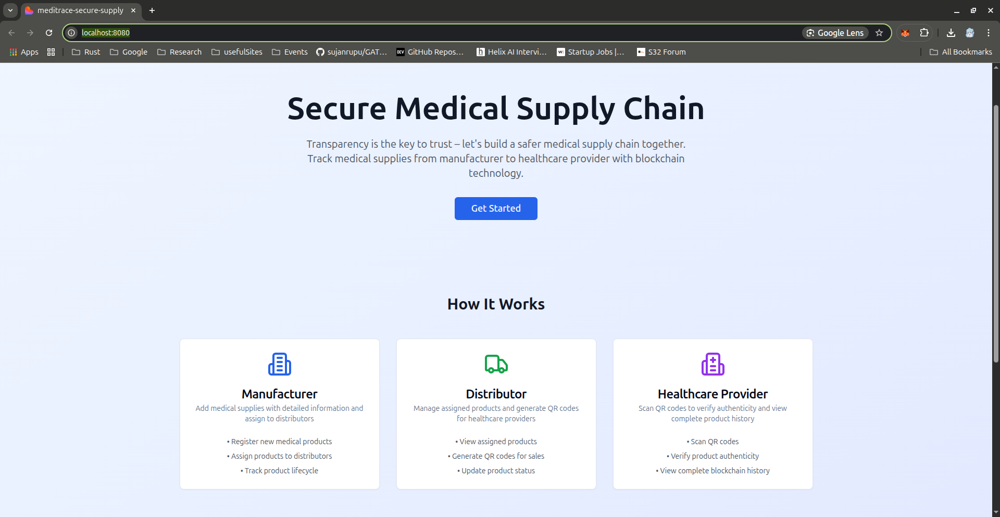
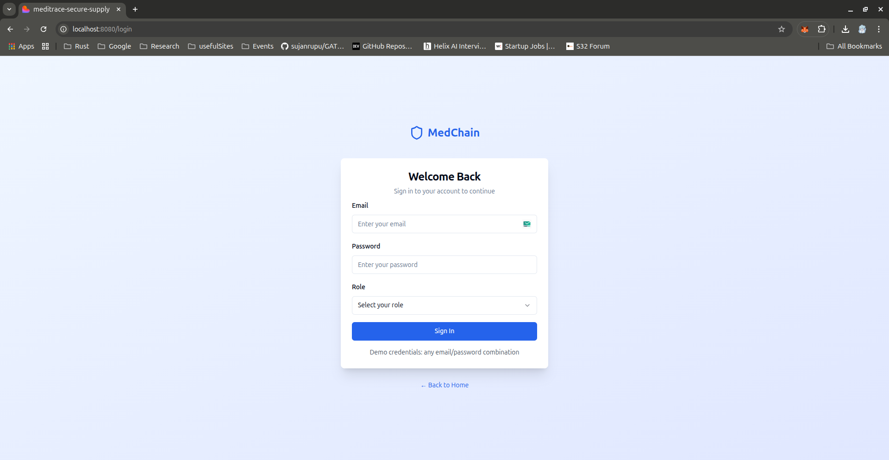
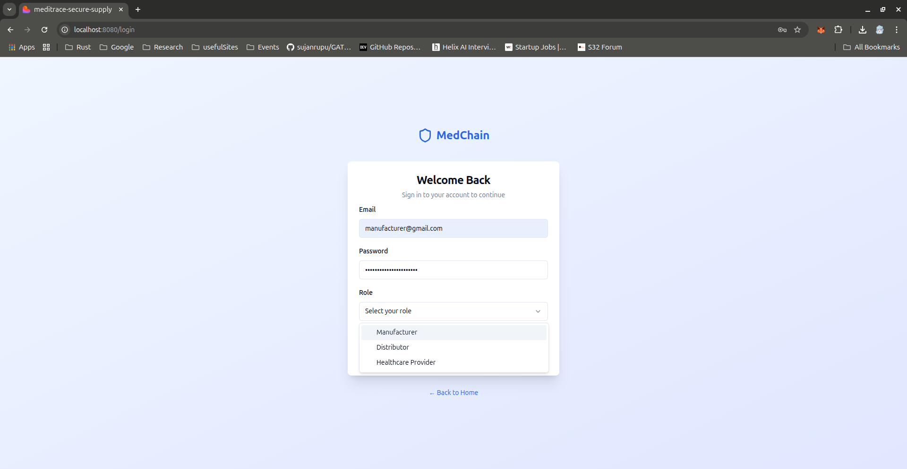
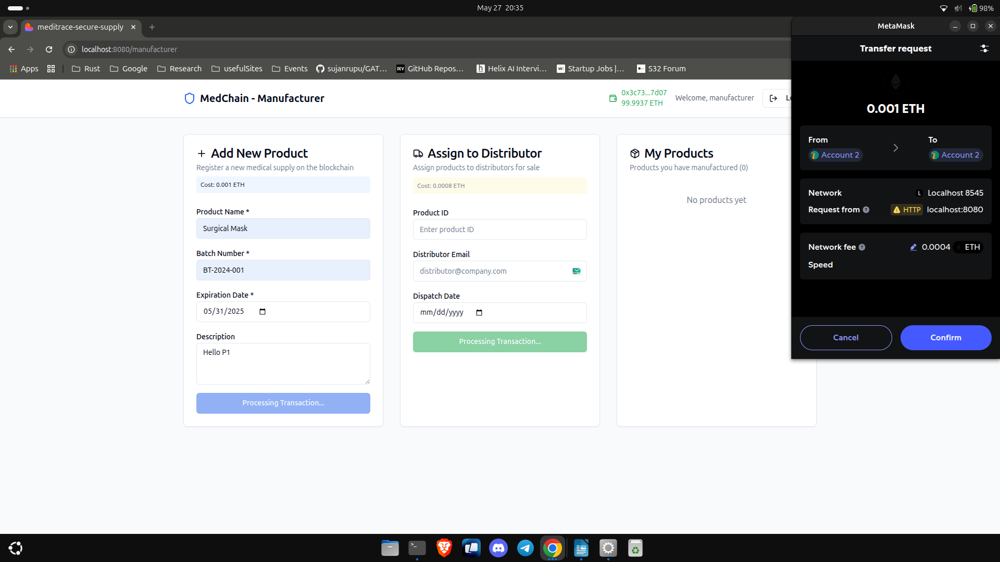
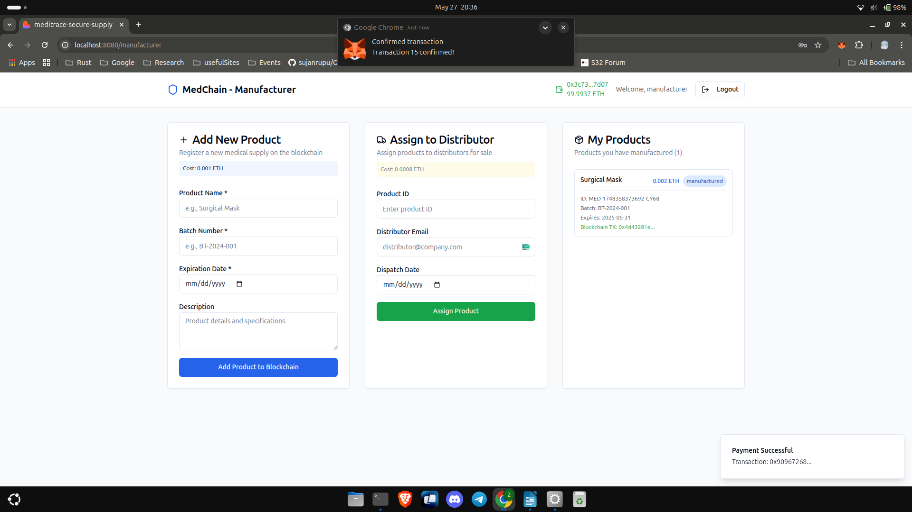
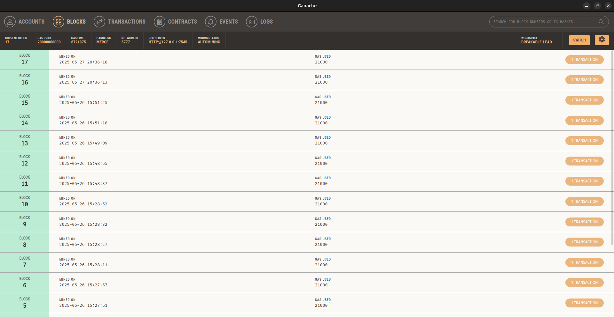

# MedChain: Secure Medical Supply Chain

MedChain is a blockchain-powered platform for tracking and authenticating medical supplies from manufacturers to healthcare providers. It ensures transparency, trust, and security in the medical supply chain using role-based dashboards and MetaMask wallet integration.

## Features

- **Blockchain Security:** Immutable transaction records for complete transparency.
- **Product Traceability:** Track every product from manufacturing to delivery.
- **QR Code Verification:** Quick and easy product authentication for healthcare providers.
- **Role-Based Access:** Secure login for manufacturers, distributors, and healthcare providers.
- **MetaMask Integration:** All critical actions require MetaMask wallet and on-chain transactions.
- **Transaction Costs:** Each blockchain action (add, assign, sell, verify) incurs a small ETH fee.

## User Roles & Dashboards

| Manufacturer | Distributor | Healthcare Provider |
|--------------|-------------|---------------------|
| Register new medical products | View assigned products | Scan QR codes to verify authenticity |
| Assign products to distributors | Generate QR codes for sales | View complete blockchain history |
| Track product lifecycle | Update product status | Verify product authenticity |

## How It Works

1. **Manufacturer** adds a new product to the blockchain and assigns it to a distributor.
2. **Distributor** receives products, sells them to healthcare providers, and generates QR codes for each sale.
3. **Healthcare Provider** scans the QR code to verify the product's authenticity and view its blockchain history.

## Tech Stack

- **Frontend:** React, TypeScript, Vite, Tailwind CSS, shadcn/ui
- **Blockchain:** Simulated on-chain logic with MetaMask wallet integration
- **State Management:** React Context API

## Transaction Costs

For demo purposes, the following ETH costs are simulated for each blockchain action:


| Action         | Cost (ETH) |
|---------------|------------|
| Add Product   | 0.001      |
| Assign Product| 0.0008     |
| Sell Product  | 0.0006     |
| Verify Product| 0.0002     |

## App Images

Below are screenshots:

<table>
  <tr>
    <td></td>
    <td></td>
  </tr>
  <tr>
    <td></td>
    <td></td>
  </tr>
  <tr>
    <td></td>
    <td></td>
  </tr>
</table>

## Getting Started

1. Install dependencies:
   ```bash
   npm install
   ```
2. Start the development server:
   ```bash
   npm run dev
   ```
3. Open [http://localhost:5173](http://localhost:5173) in your browser.

## License

MIT
